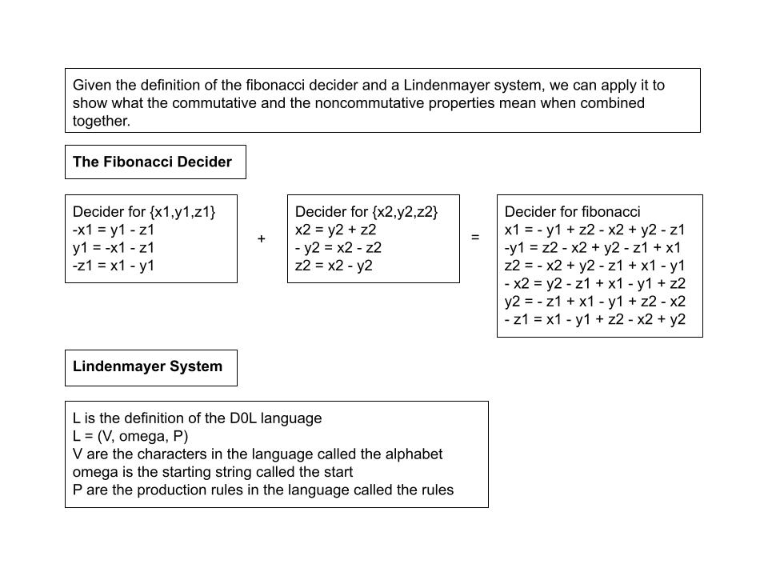
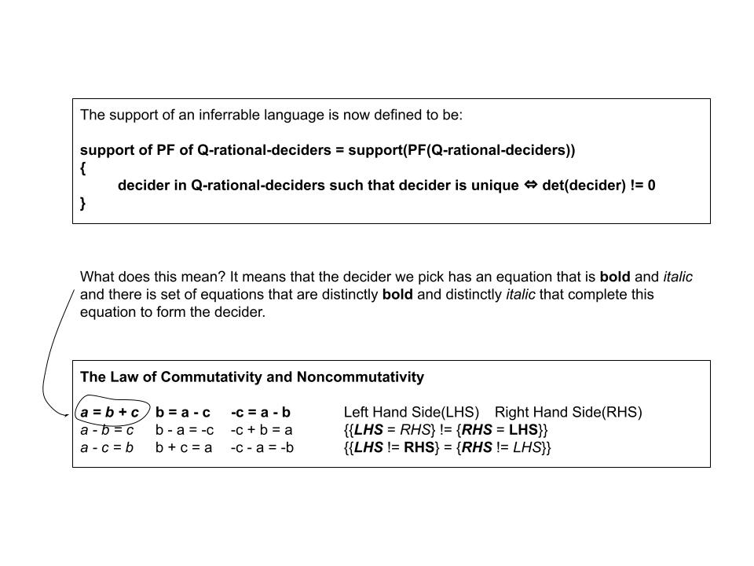
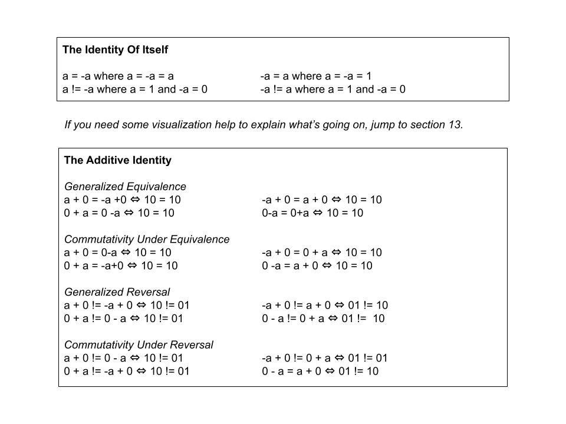
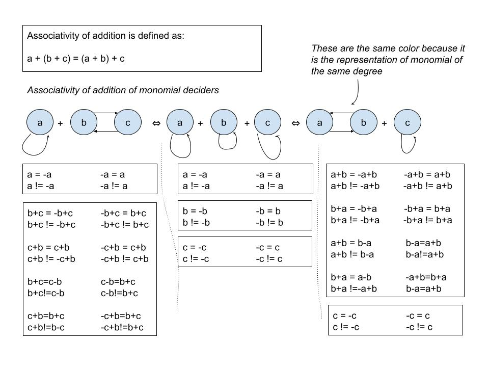
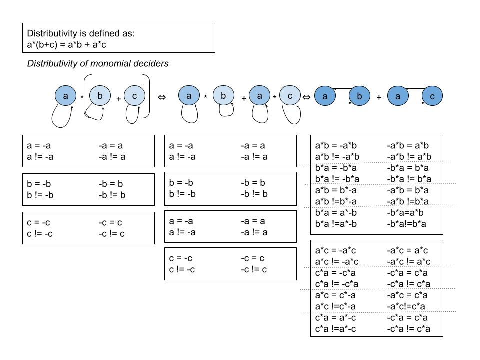

# Inferrable Languages

The concept of statistics and blackboxes has been drawn out extensively in theories and applications for decades but what of languages and knowing what word can be used to generate the next series of words? Everyone guesses what words can come out of someone talking given enough experience. In this article, the idea of inferrable languages is presented which are languages that allow the next series of words in the sequence to be inferred given enough samples in the sequence.

The article, [Inferring Lindenmayer Systems](Resources/lindenmayer_systems.pdf), is about deterministically producing the next series of words given a complete sequence of words.

Let's apply this idea with the monomial decider and picking function from the following article, [Applications for Monomial Deciders](https://github.com/ericung/ApplicationsForMonomialDeciders).

### 1. Applying The Fibonnaci Decider

### 2. Fibonacci DOL Decider Left Hand Side

### 3. Fibonacci DOL Decider Right Hand Side

### 4. The Law of Commutativity and Noncommutativity

### 5. Definition Of Support

### 6. Rationals Of Picking Function

### 7. Support Of Picking Function

### 8. Law Of Strings

### 9. Commutativity Of Addition

### 10. Commutativity Of Multiplication

### 11. Additive Identity

### 12. Multiplicative Identity

### 13. Additive Inverse

### 14. Multiplicative Inverse

### 15. Generalized Operations

### 16. Generalized Communativity

### 17. Associativity Of Addition

### 18. Associativity Of Multiplication

### 19. Distibutivity

### 20. Field

-----

# References

Weisstein, Eric W. "Field Axioms." From MathWorld--A Wolfram Web Resource. https://mathworld.wolfram.com/FieldAxioms.html

Pinter, C. C. (2010). A book of abstract algebra (2nd ed.). Dover Publications.

Ung, E. (2023). [Applications For Monomial Deciders](https://github.com/ericung/ApplicationsForMonomialDeciders) (Version 1.0.1).

Ung, E. (2023). [A Language Of Polynomials](https://github.com/ericung/languageofpolynomials) (Version 1.0.1). 

Ung, E. (2018). [Inferring Lindenmayer Systems](Resources/lindenmayer_systems.pdf).

Ung, E. [icon-opengl](https://github.com/ericung/icon-opengl).

Ung, E. [git_lsystem](https://github.com/ericung/git_lsystem).

