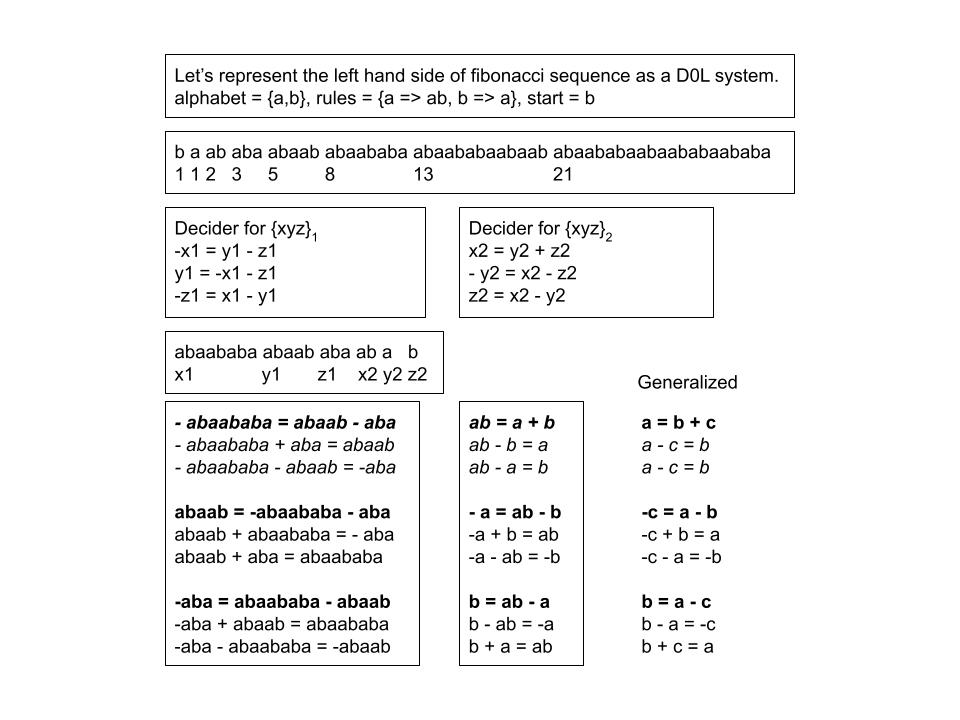
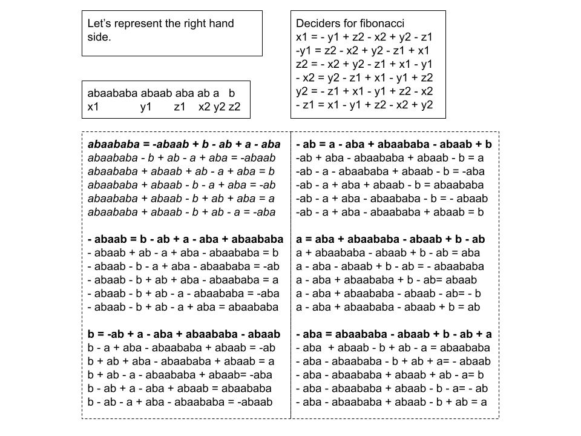

# Inferrable Languages

The concept of statistics and blackboxes has existed in the field of artificial intelligence for decades but what of languages and knowing what word can be used to generate the next series of words? Everyone guesses what words can come out of someone talking given enough experience. In this article, the idea of inferrable languages is presented which are languages that allow the next series of words in the sequence to be inferred given enough samples in the sequence.

The article, [Inferring Lindenmayer Systems](Resources/lindenmayer_systems.pdf), is about deterministically producing the next series of words given a complete sequence of words.

Let's apply this idea with the monomial decider and picking function from the following article, [Applications for Monomial Deciders](https://github.com/ericung/ApplicationsForMonomialDeciders).

### 1. Applying The Fibonnaci Decider

### 2. Fibonacci DOL Decider Left Hand Side

### 3. Fibonacci DOL Decider Right Hand Side

### 4. The Law of Commutativity and Noncommutativity

-----

# References

Ung, E. (2023). [Applications For Monomial Deciders](https://github.com/ericung/ApplicationsForMonomialDeciders) (Version 1.0.1).

Ung, E. (2023). [A Language Of Polynomials](https://github.com/ericung/languageofpolynomials) (Version 1.0.1). 

Ung, E. (2018). [Inferring Lindenmayer Systems](Resources/lindenmayer_systems.pdf).

Ung, E. [icon-opengl](https://github.com/ericung/icon-opengl).

Ung, E. [git_lsystem](https://github.com/ericung/git_lsystem).

